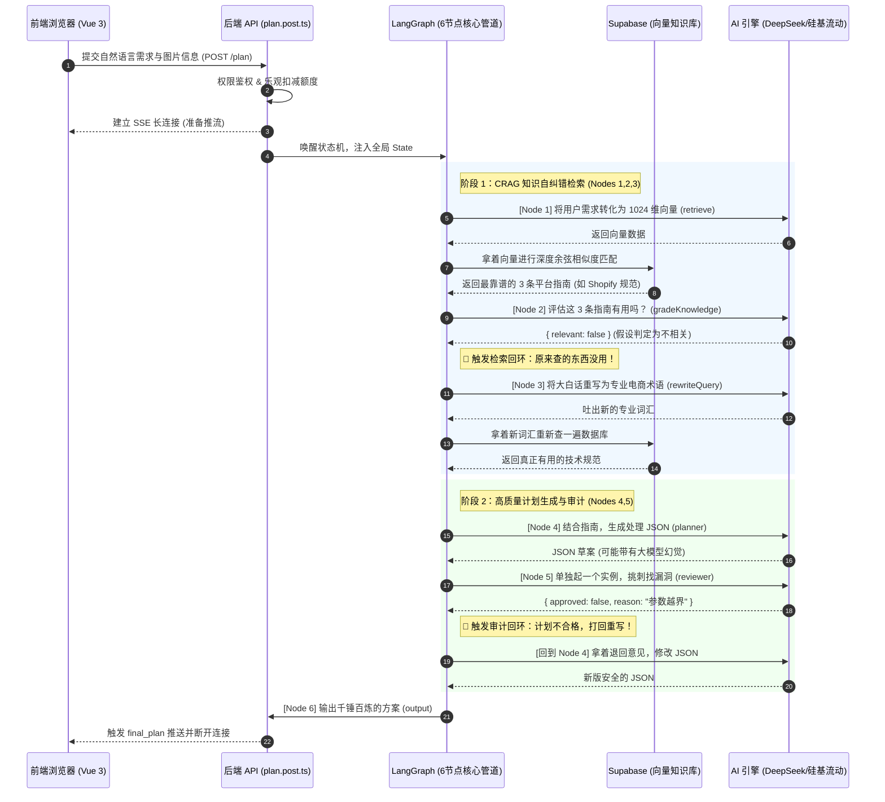
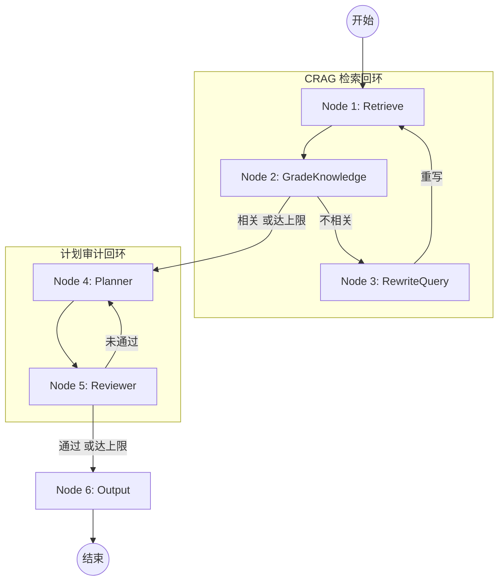

# PixelSwift Workflow Copilot: 后端完整执行流程图解

> 本文档详细梳理了用户在前端点击「生成处理计划」后，后端（Node.js / Nuxt 3 / Cloudflare Workers环境）发生的所有详细动作。涵盖了从接收请求、权限校验、Corrective RAG (CRAG)检索、计划生成、审计，到最终 SSE (Server-Sent Events) 流式推送返回的全生命周期。

---

## 1. 核心架构拓扑图

---

## 2. 每一步详细流程解析

整个流程分为 **预处理层** 和 **AI 编排层 (LangGraph)** 两个阶段。

### 阶段一：预处理层 (`plan.post.ts`)

当服务器接收到前端发来的 `POST` 请求时：

1. **环境与权限校验**：
   - 使用 Zod 校验前端传来的请求体，确保 `goal` (用户的自然语言指令) 和 `batch` (图片摘要信息，包括宽高、大小、格式) 数据结构正确。
   - 读取环境变量里的 `NUXT_DEEPSEEK_API_KEY` 和 `NUXT_OPENAI_API_KEY`，如果没配直接抛出 `500` 错误。
   - 通过 `serverSupabaseUser(event)` 鉴权，必须是已登录用户。

2. **配额扣减 (乐观扣减)**：
   - 走 `deductTrialUsage` 函数，先去数据库 `user_entitlements` 表里检查用户额度，如果没有额度或者额度耗尽，直接返回 `403` 拒绝。
   - 如果有额度，**先扣减额度**（防止刷单），如果后续 AI 规划彻底失败或者崩溃，系统会触发补救机制将额度退回。

3. **构建 SSE 流并触发图模型**：
   - 建立 `text/event-stream` 响应，准备将后端的每一步进度推送给前端。
   - 唤醒 LangGraph 并将参数（包括目标、批次、API Keys、Supabase连接）投喂给它。

---

### 阶段二：AI 编排层 (LangGraph 6节点管道)

这里是真正的核心，代码位于 `server/lib/copilot/graph.ts`，由 LangGraph 控制步骤流转，它像一个流水线工厂。

#### Node 1: `retrieve` (找资料)

- **动作**：系统收到比如「为了上架 Amazon」这样的诉求。通过硅基流动 API 将这句话转换成 1024 维度的数字向量 (`embedding`)。
- **匹配**：拿着这个向量去 Supabase `knowledge_documents` 表里用 `pgvector` 算余弦相似度，找出最匹配的 3 条知识片段。
- **Fallback**：如果数据库连不上，或者没配向量化 key，系统不会崩溃，而是瞬间降级为“关键词字典匹配”（旧逻辑）。

#### Node 2: `gradeKnowledge` (判卷子)

- **动作**：检索出来的资料一定有用吗？不一定。这时候召唤 DeepSeek，把用户诉求和检索出的资料发给它，命令它做一个无情的「相关性打分员」。
- **判断**：它只会返回一个严格的 JSON：`{ "relevant": true/false, "confidence": 0.9, "reason": "..." }`。
- **决定去向**：
  - 如果判定相关，拿着资料去 `planner`。
  - 如果判定**不相关**，走入回环，进入 `rewriteQuery` 节点。

#### Node 3: `rewriteQuery` (换个问法 - 条件触发)

- **动作**：如果资料牛头不对马嘴，说明客户说的话不够专业、或者是其他国家的语言（例如日语）。
- **执行**：召唤 DeepSeek，让它把大白话转化成老练的英文图片处理术语。
- **走向**：转化完术语之后，再把这个新词汇扔给 `retrieve` 节点重新去数据库找资料。

#### Node 4: `planner` (大脑规划)

- **动作**：此时我们有了**精确的用户需求**、**图片尺寸信息**以及**高质量的平台知识（刚查出来的）**。
- **执行**：将这三者拼装成极其详尽的 Prompt 模板，再次召唤 DeepSeek。
- **强约束**：通过 LangChain 的 `withStructuredOutput(jsonMode)`，强迫 DeepSeek 的回答绝对不能是散文，必须是符合我们前端所需要的深层 JSON 嵌套结构（就是包含 `resize`, `compress`, `convert` 这三个大动作对应参数的数组）。

#### Node 5: `reviewer` (审计主任)

- **动作**：`planner` 有时候会做梦乱写，或者写的参数不符合物理规律（比如目标尺寸巨大但约束大小要求 10KB）。
- **执行**：用低温度配置调起**另一个独立的 DeepSeek 实例**。把 `planner` 写的第一版 JSON 草案发给它。
- **决定去向**：它返回审核报告 JSON：
  - 如果 `approved: true`，恭喜，过关。
  - 如果 `approved: false`，指出它的错误在哪里，带着批注把任务**打回给 `planner` 重写**（这就是计划质量条件回环）。

#### Node 6: `output` (出单)

- 将经过千锤百炼的 JSON 处理计划以及审核评语，正式装配入状态机的终点。

---

## 3. SSE 流式前端感知

在 LangGraph 的流水线飞速运转的同时，`plan.post.ts` 并没有等它全部干完，而是将进程"直播"给前端。

由于前后端建立的是 Server-Sent Events 连接，每当通过 1 个 Node，就会立刻给前端发射一帧数据包：

1. `event: message`, `data: { type: "progress", node: "retrieve", ... }`
   _(前端界面显示字幕："正在检索专业知识库...")_
2. `event: message`, `data: { type: "progress", node: "gradeKnowledge", ... }`
   _(前端界面显示字幕："正在验证知识有效性...")_
3. ...直到最后一步...
4. `event: message`, `data: { type: "final_plan", plan: { ... } }`
   _(前端接到大 JSON，立刻将其渲染成了直观的流程卡图表)_

### 异常兜底机制

如果在任意中途出现不可逆奔溃（API Key 欠费、网络极度卡顿）：

- 会在抛出错误之前，触发**额度退还**函数，保证用户不扣冤枉钱。
- 给前端发一条 `event: error`, `data: { message: "xxx" }` 用来进行 Toast 提示。

---

## 4. 为什么这样设计？(面试亮点总结)

1. **绝对稳定、拒绝幻觉**：这套系统的根本是为了产出一份**机器 100% 能看懂并去浏览器 Canvas 执行的指令 JSON**，容不得半点幻觉。`Planner + Reviewer` 双重保险制完美保证了 JSON Schema 的绝对安全。
2. **知识与代码解耦**：如果明天淘宝、Shopify 改了图片尺寸要求，不需要发版，甚至不用改代码。只需要去 Supabase 直接改掉那条资料的文本内容，CRAG 就会自动拉取最新的标准。
3. **极佳的可视化交互**：把繁重的服务器推理时长（通常要耽搁 3-6 秒）通过切分 Node 并利用 SSE 实时下发，前端就能做出逐级亮起的进度条，把用户的"等待"转化为了"欣赏 AI 工作"的高级科技感。
