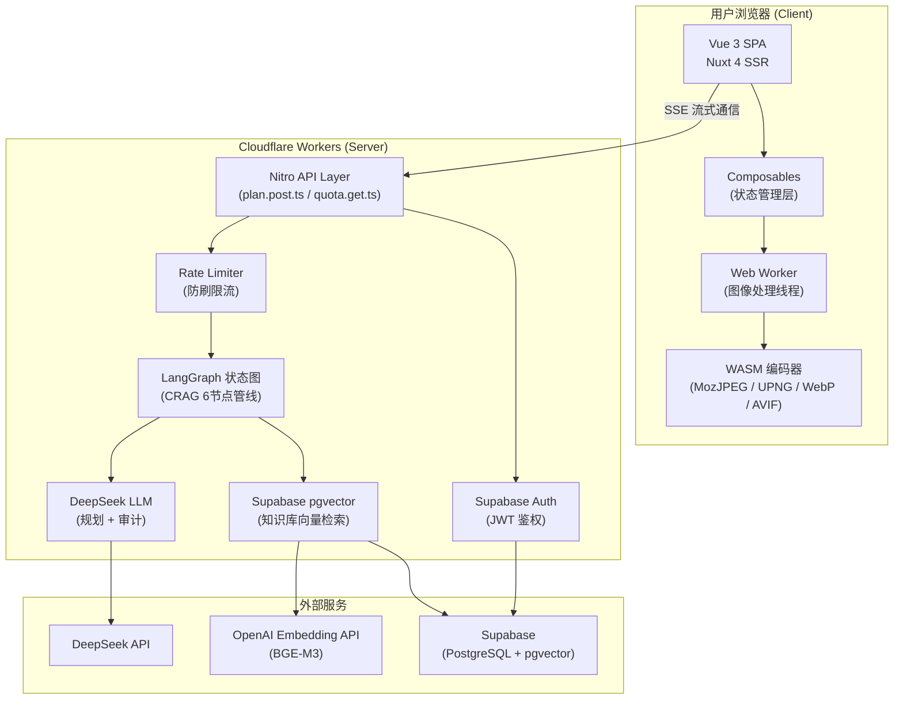
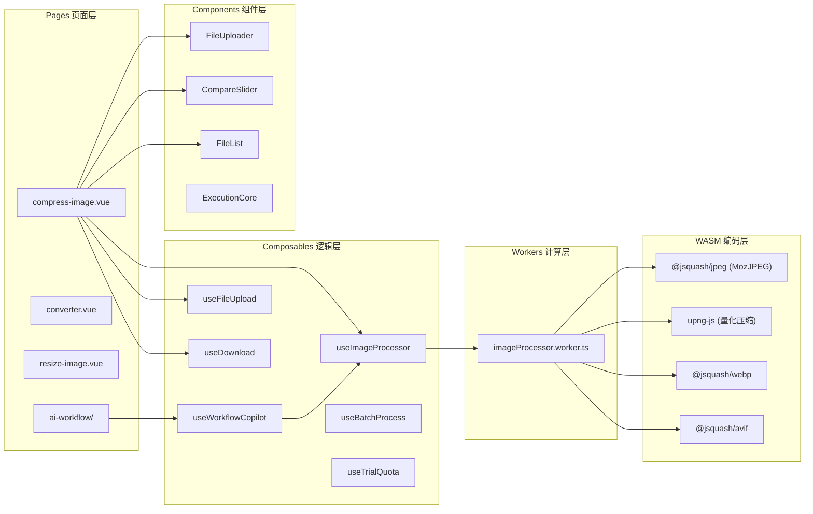
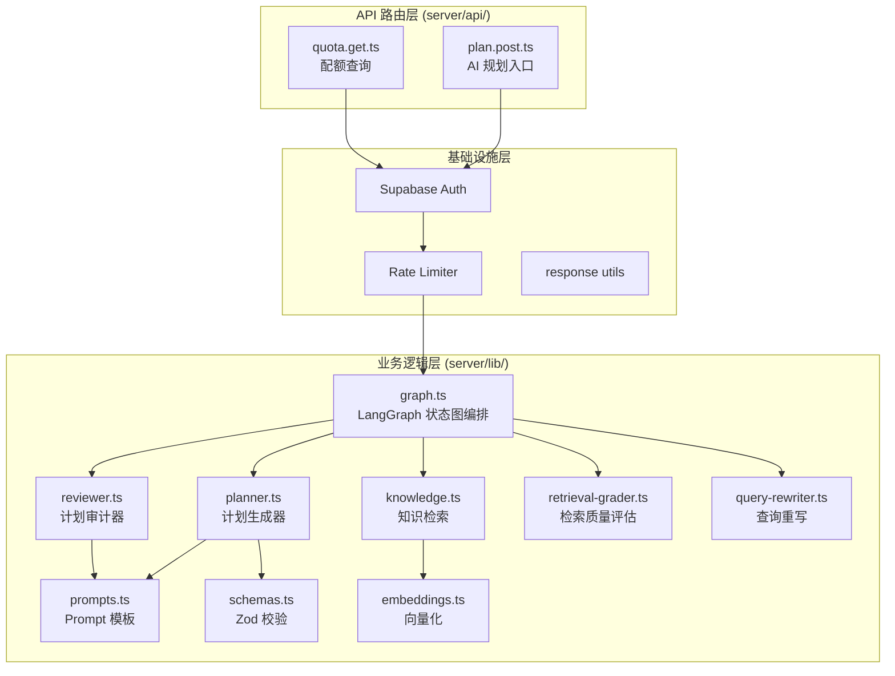
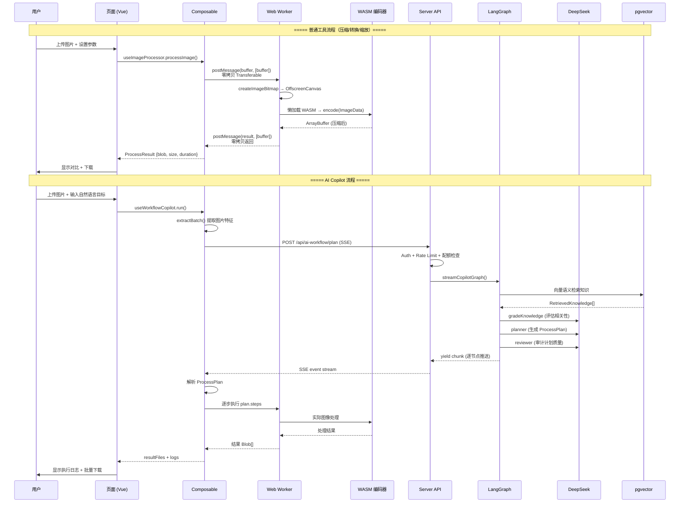
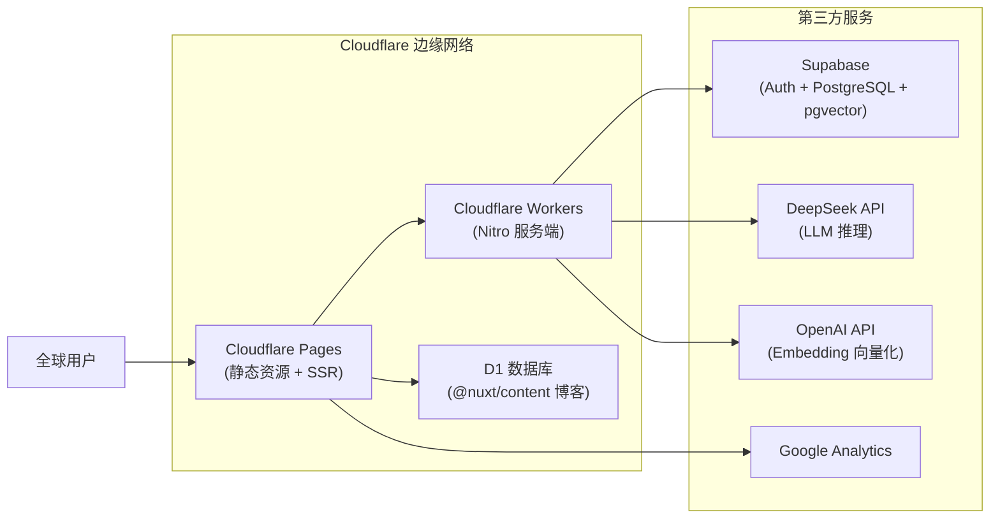

# PixelSwift 面试准备（一）：项目全景与系统架构

> 本文档基于项目真实源码梳理，帮助你在面试中清晰、深入地阐述项目的整体架构与技术选型。

---

## 1. 项目一句话定位

**PixelSwift** 是一个浏览器端零上传的智能图片处理平台，核心卖点：
- 图片压缩/转换/缩放 **全部在浏览器完成**，不经过服务器 → **隐私安全 + 零带宽成本**
- 内置 AI Copilot，用户用自然语言描述需求，后端 AI 自动规划多步骤处理指令，前端自动执行

---

## 2. 整体架构总览

### 架构核心设计决策

| 决策 | 选择 | 理由 |
|------|------|------|
| 图片处理位置 | 浏览器端 | 零带宽成本 + 隐私安全，服务端不接触原图 |
| 重计算隔离 | Web Worker | 像素级操作全部 off-thread，主线程零卡顿 |
| 编码器选型 | WASM (@jsquash) | MozJPEG 比 Canvas API 压缩率高 30%+，跨浏览器一致 |
| AI 通信协议 | SSE (Server-Sent Events) | 单向推流，比 WebSocket 轻量，天然适配进度推送 |
| AI 编排框架 | LangGraph | 支持条件边+回环，天然适配 CRAG 自纠错管线 |
| 部署平台 | Cloudflare Pages/Workers | 全球边缘节点，冷启动 <50ms，Serverless 免运维 |
| 数据库 | Supabase (PostgreSQL) | 自带 Auth + pgvector 扩展，一套服务覆盖鉴权+向量检索 |

---

## 3. 前端分层架构

### 关键分层原则（面试要点）

1. **页面只做组装**：compress-image.vue 只负责 UI 布局和用户交互，不直接操作 ArrayBuffer
2. **逻辑下沉到 Composable**：`useImageProcessor` 封装 Worker 通信，`useBatchProcess` 封装并发调度
3. **计算隔离到 Worker**：所有像素级操作都在 `imageProcessor.worker.ts` 中执行
4. **编码器按需懒加载**：WASM 模块通过 `dynamic import` 按需加载，首屏不加载编码器

---

## 4. 后端分层架构

### 后端关键设计

- **所有 LangChain 依赖使用 `dynamic import`**：Cloudflare Workers 禁止在全局作用域执行副作用，所以 ChatDeepSeek、SupabaseVectorStore、ChatPromptTemplate 全部延迟加载
- **模型实例缓存**：通过 `Map<fingerprint, model>` 避免每次请求重建 LLM 实例
- **乐观扣减 + 失败回退**：先扣配额再调 AI，AI 失败则回退配额，保证用户体验

---

## 5. 数据流全景

---

## 6. 部署架构

### 部署配置要点

| 配置项 | 值 | 说明 |
|--------|-----|------|
| `nitro.preset` | `cloudflare-pages` | Nuxt 构建产物适配 CF Pages |
| `compatibility_flags` | `["nodejs_compat"]` | LangChain 依赖 Node.js 原生模块 |
| D1 绑定 | `pixelswift-content` | 博客 Markdown 内容存储 |
| WASM 插件 | `vite-plugin-wasm` + `top-level-await` | Worker 内 WASM 模块加载 |

---

## 7. 面试话术：如何介绍项目架构

> **面试官问："介绍一下你这个项目的架构？"**

参考回答：

> PixelSwift 采用 **"后端重推理 + 前端轻执行"** 的协作架构。
>
> **前端**基于 Nuxt 4 + Vue 3，图片处理全部在浏览器端完成——用户上传的图片不经过服务器，通过 Web Worker + WebAssembly 编码器在独立线程中进行像素级操作，主线程完全不卡顿。这样设计有两个好处：一是零带宽成本，服务端不处理图片二进制；二是用户隐私有保障，图片从不离开浏览器。
>
> **后端**部署在 Cloudflare Workers 上，是纯 Serverless 架构。核心功能是 AI Copilot 模块——使用 LangGraph 编排了一个 6 节点的 CRAG（Corrective RAG）自纠错管线。用户用自然语言描述需求，后端会先做向量语义检索获取平台知识，然后 LLM 生成结构化的处理计划，再由另一个 LLM 审计计划质量，审计不通过会回环重新生成。最终通过 SSE 实时推流到前端执行。
>
> **数据层**用 Supabase 一套打通鉴权和向量检索——PostgreSQL + pgvector 扩展，既存用户配额数据，也做知识库的语义相似度搜索。
