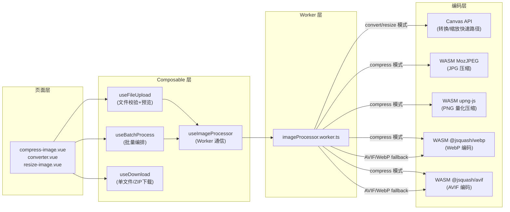
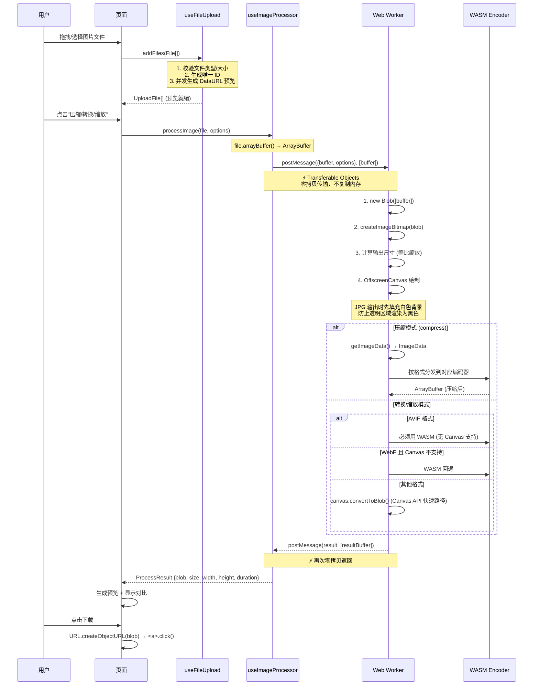
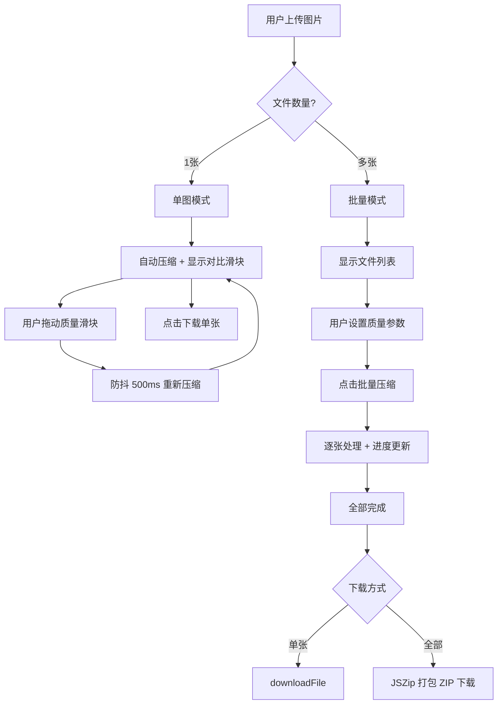
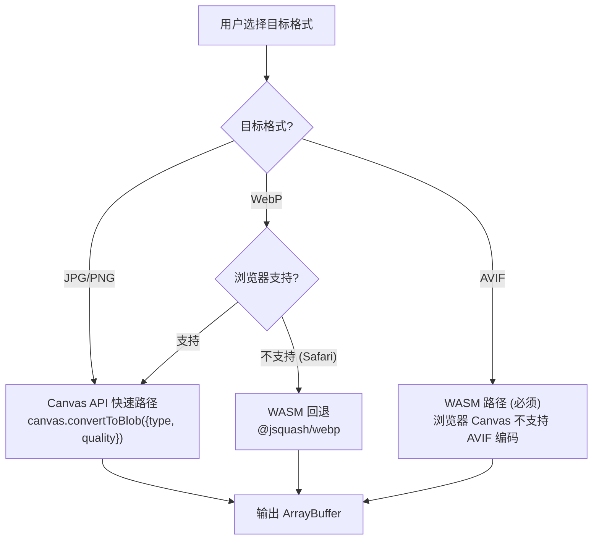
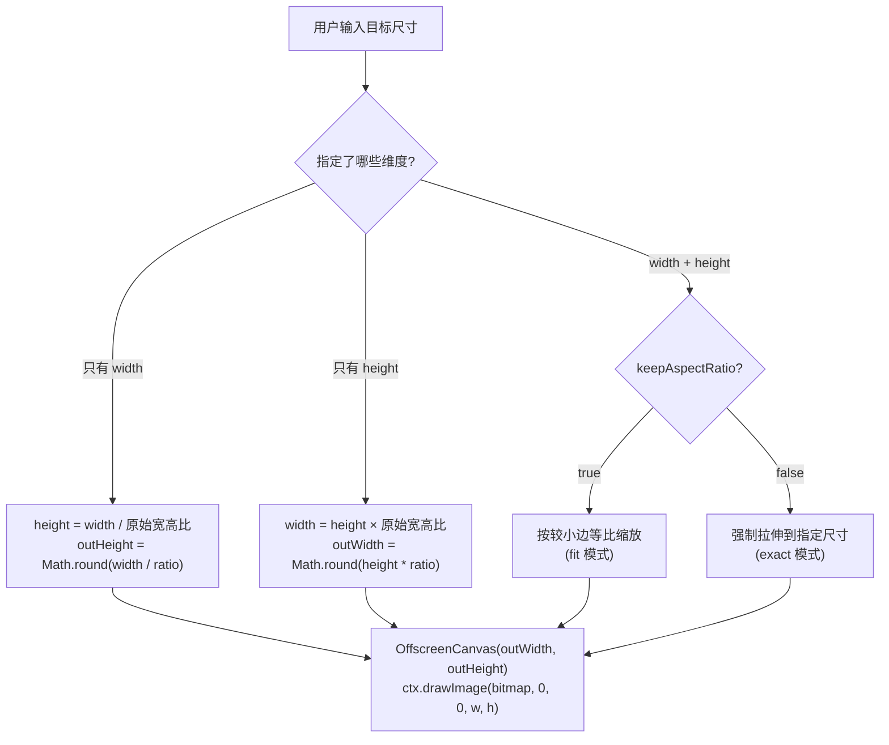
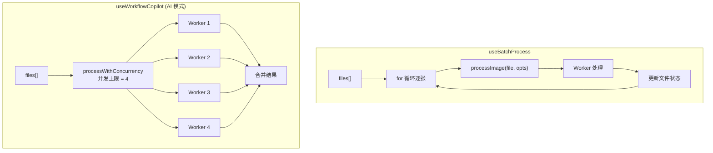

# PixelSwift 面试准备（二）：三大核心工具深度解析

> 本文档详细拆解 **图片压缩、格式转换、尺寸调整** 三个核心工具的完整实现链路。

---

## 1. 三个工具的统一处理架构

三个工具共享同一条处理管线，区别仅在于 Worker 内部的编码策略：



---

## 2. 数据流：从上传到下载的完整生命周期



---

## 3. 图片压缩工具 (compress-image) 深度解析

### 3.1 业务流程



### 3.2 压缩编码器选型与原理

| 格式 | 编码器 | 压缩原理 | 关键参数 |
|------|--------|----------|----------|
| **JPG** | MozJPEG (`@jsquash/jpeg`) | DCT 变换 + 优化霍夫曼编码 + 渐进式扫描 | `quality: 1-100` |
| **PNG** | upng-js | 色彩量化（256色调色板）+ DEFLATE 压缩 | `cnum: 16-256`（由 quality 映射） |
| **WebP** | `@jsquash/webp` | VP8 有损压缩 / VP8L 无损压缩 | `quality: 1-100` |
| **AVIF** | `@jsquash/avif` | AV1 帧内编码（基于视频编码技术） | `quality: 1-100` |

**关键实现细节（面试重点）：**

```
// PNG 压缩的 quality → 色数映射
// quality 1-100 → 色数 16-256
const cnum = Math.round(16 + (quality / 100) * (256 - 16));
// 类似 TinyPNG 的原理：把真彩 PNG 量化为调色板 PNG
UPNG.encode([imageData.data.buffer], width, height, cnum);
```

### 3.3 面试话术

> **问："你的图片压缩是怎么实现的？为什么不用 Canvas API？"**

> 我们对比过 Canvas API 的 `toBlob()` 和 WASM 编码器的压缩效果。Canvas API 底层使用的是浏览器内置编码器，不同浏览器实现不一致，而且 JPEG 编码用的不是 MozJPEG——MozJPEG 相比标准 libjpeg 能在同等画质下多压缩 20-30%。
>
> 所以我们选择了 `@jsquash` 系列的 WASM 编码器。它把 MozJPEG、libwebp、libavif 这些 C/C++ 编码库编译成了 WebAssembly，在浏览器里直接跑原生编码算法。PNG 用的是 upng-js 的色彩量化，原理类似 TinyPNG——把真彩 PNG 量化成最多 256 色的调色板 PNG，文件体积能缩小 60-80%。
>
> 所有编码操作都在 Web Worker 里异步执行，通过 `Transferable Objects` 实现零拷贝数据传输，主线程完全不做像素级计算。

---

## 4. 格式转换工具 (converter) 深度解析

### 4.1 编码策略分流



### 4.2 关键细节

- **WebP 兼容性检测**：运行时使用 `OffscreenCanvas.convertToBlob({type: 'image/webp'})` 探测浏览器是否支持 WebP 编码，结果缓存在 `_canvasWebPSupport` 变量中
- **透明度处理**：PNG → JPG 转换时，先用 `ctx.fillStyle = '#ffffff'` 填充白色背景，防止 alpha 通道渲染为黑色
- **格式快速路径**：非压缩场景下（convert/resize），优先用 Canvas API，速度比 WASM 快 3-5 倍

### 4.3 面试话术

> **问："PNG 转 JPG 有什么需要注意的？"**

> 最典型的坑是透明度处理。PNG 支持 alpha 通道，但 JPG 不支持。如果直接把带透明区域的 PNG 绘制到 Canvas 上再导出 JPG，透明部分会变成黑色——因为 Canvas 默认背景就是透明（rgba 0,0,0,0），JPG 编码时 alpha 被丢弃，只剩 RGB(0,0,0) 就是黑色。
>
> 我们的做法是在 `drawImage` 之前先 `fillRect` 填充白色背景，这样透明区域就变成了白色而不是黑色。这个细节看起来简单，但线上确实遇到过用户反馈转出来全黑的 bug。

---

## 5. 尺寸调整工具 (resize-image) 深度解析

### 5.1 等比缩放逻辑



### 5.2 关键实现

```typescript
// Worker 内部的等比缩放计算
if (keepAspectRatio !== false && (width || height)) {
  const ratio = bitmap.width / bitmap.height;
  if (width && !height) {
    outHeight = Math.round(width / ratio);     // 只给宽度 → 自动算高度
  } else if (height && !width) {
    outWidth = Math.round(height * ratio);      // 只给高度 → 自动算宽度
  }
}
```

---

## 6. 批量处理与并发控制

### 6.1 并发模型



### 6.2 并发控制实现

```typescript
// Worker 池模式：限制最多 4 个并发任务
const CONCURRENCY = 4;
async function processWithConcurrency(items, fn) {
  let running = 0, idx = 0;
  return new Promise((resolve, reject) => {
    function next() {
      if (idx >= items.length && running === 0) { resolve(); return; }
      while (running < CONCURRENCY && idx < items.length) {
        const i = idx++;
        running++;
        fn(items[i], i)
          .then(() => { running--; next(); })
          .catch(reject);
      }
    }
    next();
  });
}
```

**面试要点：**
- 普通工具页面是串行处理（for 循环），简单可靠
- AI Copilot 是并发处理（上限 4），因为 AI 产出的计划通常包含多个步骤，并发能加速整体耗时
- 并发上限设为 4 是经验值：Web Worker 是单线程的（只有一个 Worker 实例），并发的意义在于 WASM 编码的 I/O 等待期可以交错

---

## 7. 下载模块

### 7.1 单文件下载

```typescript
// 核心：URL.createObjectURL + <a> 标签
function downloadFile(blob: Blob, filename: string) {
  const url = URL.createObjectURL(blob);  // Blob → 临时 URL
  const a = document.createElement('a');
  a.href = url;
  a.download = filename;                   // 设置文件名
  a.click();                               // 触发下载
  URL.revokeObjectURL(url);                // 释放内存
}
```

### 7.2 批量 ZIP 下载

```typescript
// JSZip 动态导入，不参与首屏 bundle
async function downloadAsZip(files, zipName) {
  const { default: JSZip } = await import('jszip');  // 按需加载
  const zip = new JSZip();
  for (const file of files) {
    zip.file(file.name, file.blob);
  }
  const content = await zip.generateAsync({ type: 'blob' });
  downloadFile(content, zipName);
}
```

### 7.3 文件命名规则

| 操作 | 命名模式 | 示例 |
|------|----------|------|
| 压缩 | `{原名}_compressed.{原格式}` | `photo_compressed.jpg` |
| 转换 | `{原名}.{新格式}` | `photo.webp` |
| 缩放 | `{原名}_{宽}x{高}.{原格式}` | `photo_800x600.jpg` |
| ZIP | `pixelswift_{操作}_{日期}.zip` | `pixelswift_compress_20260508.zip` |
