# PixelSwift 面试准备（三）：AI Workflow Copilot 深度解析

> 本文档深度拆解 AI Copilot 的完整实现：CRAG 管线、LangGraph 编排、SSE 流式通信、前端执行引擎。

---

## 1. AI Copilot 整体流程

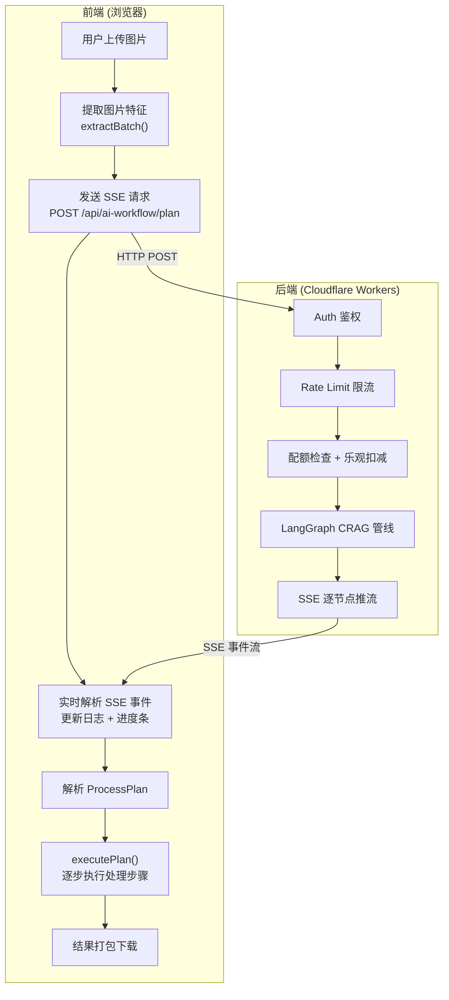

---

## 2. 前端特征提取（不上传原图）

这是架构的核心隐私设计：**原图永远不离开浏览器**，只把元数据发给后端。

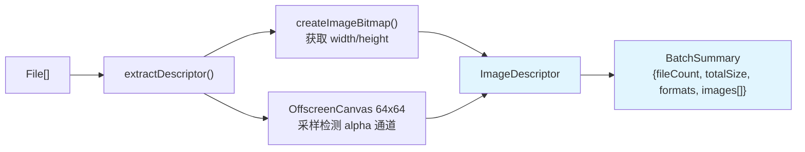

### 发送给后端的数据结构（注意：没有图片二进制）

```typescript
interface ImageDescriptor {
  id: string;           // "img-0-1715150400000"
  fileName: string;     // "photo.jpg"
  width: number;        // 4032
  height: number;       // 3024
  sizeBytes: number;    // 5242880
  format: string;       // "jpeg"
  hasAlpha: boolean;    // false
}

interface BatchSummary {
  fileCount: number;    // 5
  totalSizeBytes: number; // 26214400
  formats: string[];    // ["jpeg", "png"]
  images: ImageDescriptor[];
}
```

### Alpha 检测算法

```typescript
// 只对可能有透明度的格式 (png/webp/avif) 做像素级检测
// 缩小到 64x64 采样，避免大图内存爆炸
const canvas = new OffscreenCanvas(Math.min(width, 64), Math.min(height, 64));
const ctx = canvas.getContext('2d');
ctx.drawImage(bitmap, 0, 0, canvas.width, canvas.height);
const pixels = ctx.getImageData(0, 0, canvas.width, canvas.height).data;

// 每 4 字节 = RGBA，检查第 4 个字节（Alpha）是否全为 255
for (let i = 3; i < pixels.length; i += 4) {
  if (pixels[i] < 255) { hasAlpha = true; break; }
}
```

**面试话术：为什么要检测 Alpha？**
> 因为 AI 生成计划时需要知道图片是否有透明度。如果用户的 PNG 有透明背景，AI 就不应该建议转成 JPG（会丢失透明度）。我们不是靠文件扩展名判断，而是真正做了像素级采样——因为有些 PNG 虽然格式支持透明，但实际上每个像素的 alpha 都是 255（纯不透明），这种情况转 JPG 是安全的。

---

## 3. 后端 API 层：plan.post.ts

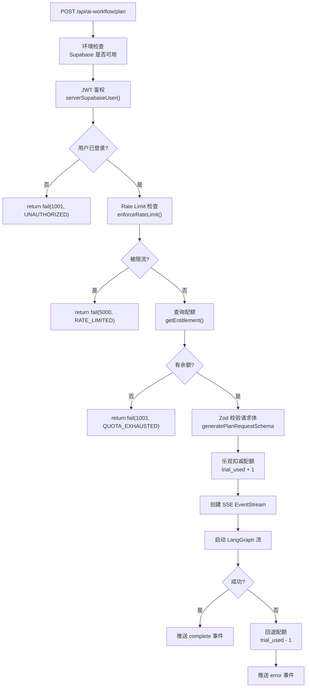

### 乐观扣减 + 失败回退（面试重点）

```typescript
// 先扣后用：乐观扣减
await deductTrialUsage(event, userId);  // trial_used + 1

try {
  // 运行 LangGraph ...
  // 成功：配额已扣，不需要额外操作
} catch (err) {
  // 失败：回退配额
  await refundTrialUsage(event, userId);  // trial_used - 1
}
```

> **为什么不用事务？** 因为 Supabase 的 REST API 不支持跨表事务。我们用 Rate Limiter 保证单用户不会高并发，所以 read-then-update 的竞态窗口极小，配合乐观扣减足够可靠。

---

## 4. LangGraph CRAG 管线（核心中的核心）

### 4.1 完整状态图

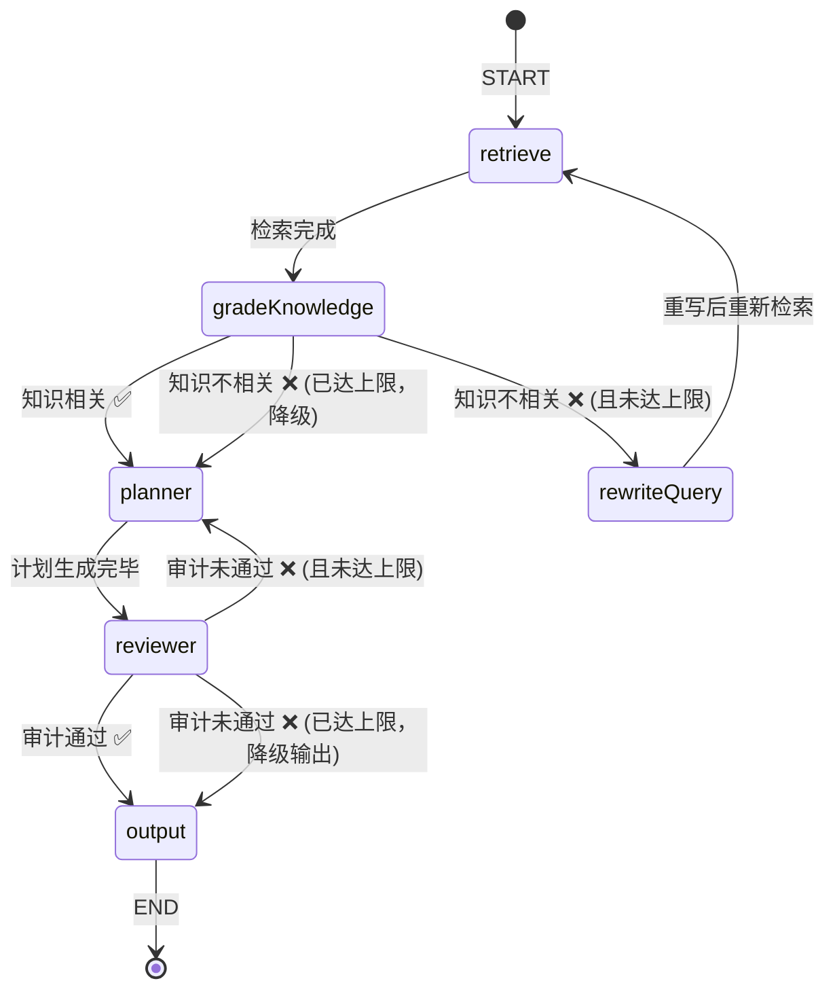

### 4.2 六个节点详解

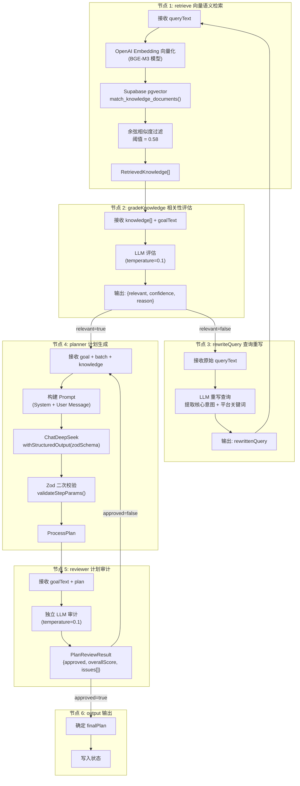

### 4.3 两条自纠错回环

#### 回环 1：检索质量纠错

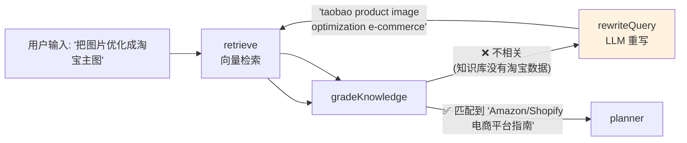

**关键参数：**
- 最大检索重试 `MAX_RETRIEVAL_ATTEMPTS = 2`
- 超过上限 → 降级（不带知识直接进 planner）

#### 回环 2：计划质量纠错

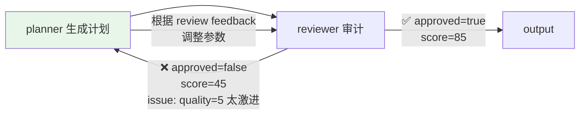

**关键参数：**
- 最大规划重试 `MAX_ATTEMPTS = 2`
- 超过上限 → 降级输出（使用最后一次计划）

### 4.4 双模型隔离

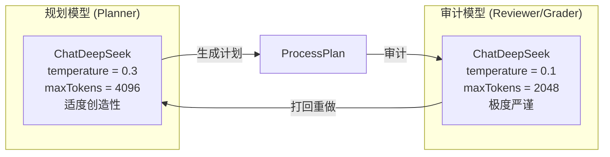

**面试话术：为什么用两个不同温度的模型？**
> 这是"任务规划层 + 安全审计层"的双模型隔离设计。Planner 用 temperature=0.3，需要适度的创造性来理解模糊的用户意图（比如"优化成电商主图"）；Reviewer 用 temperature=0.1，极低温度保证审计结果稳定、严谨，不会"宽容地"放过有参数错误的计划。两个模型互相制衡，确保 AI 幻觉不会穿透到前端执行。

---

## 5. Prompt 工程

### 5.1 Planner System Prompt 核心设计

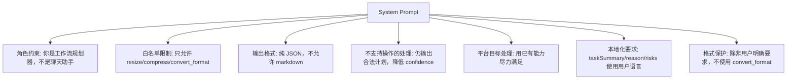

### 5.2 User Message 构建

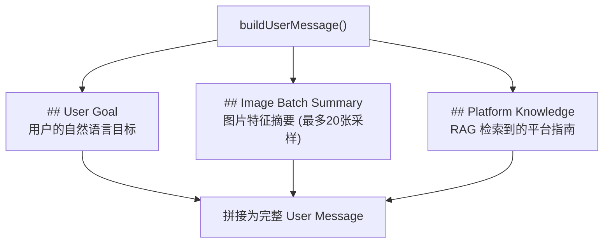

### 5.3 结构化输出保障

```typescript
// 使用 Zod Schema 约束 AI 输出
const structuredModel = chatModel.withStructuredOutput(processPlanSchema, {
  name: 'ProcessPlan',
  method: 'jsonMode',  // 强制 JSON 模式
});

// 即使 AI 输出合法 JSON，仍做二次校验
const paramErrors = validateStepParams(plan);
// 校验每个 step 的 params 是否在合理范围
// resize: width/height ∈ [1, 10000]
// compress: quality ∈ [1, 100]
// convert_format: targetFormat ∈ {webp, jpeg, png, avif}
```

---

## 6. SSE 流式通信

### 6.1 后端推流

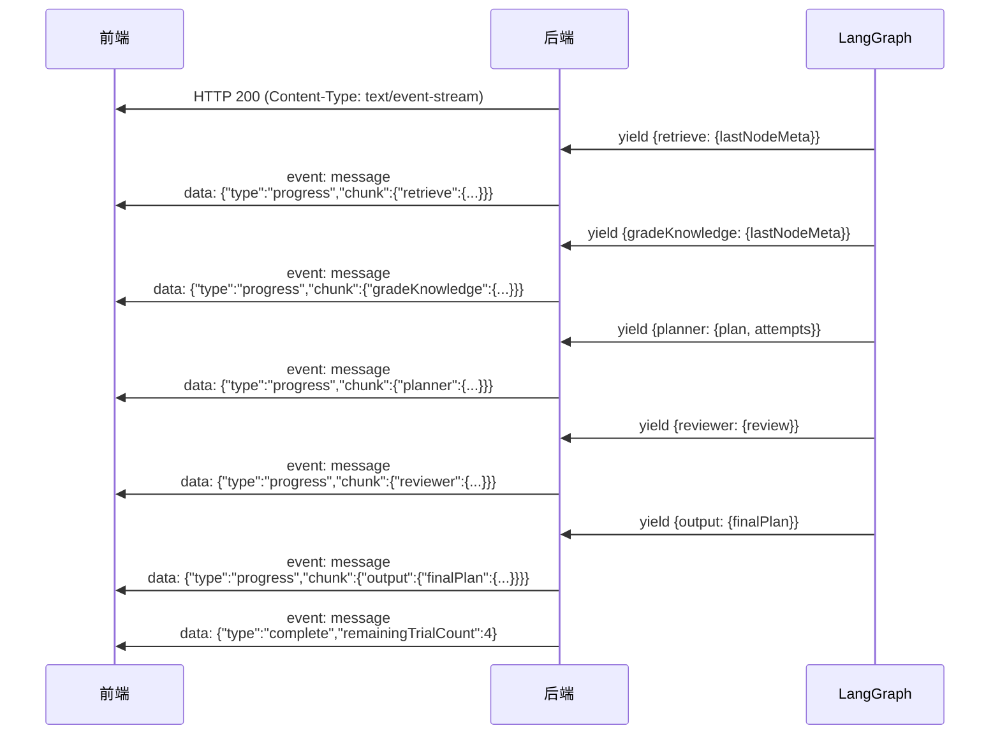

### 6.2 前端 SSE 解析

```typescript
// 读取 SSE 流
const reader = response.body.getReader();
const decoder = new TextDecoder();
let buffer = '';

while (true) {
  const { value, done } = await reader.read();
  if (done) break;

  buffer += decoder.decode(value, { stream: true });
  const parts = buffer.split('\n\n');  // SSE 事件以双换行分隔
  buffer = parts.pop() || '';          // 最后一个可能不完整，保留

  for (const part of parts) {
    // 解析 event: 和 data: 行
    const parsed = parseSSEPart(part);
    handleSSEEvent(parsed.eventType, parsed.dataStr);
  }
}
```

### 6.3 进度条策略（假进度 + 真进度混合）

```mermaid
gantt
    title 进度条时间线
    dateFormat X
    axisFormat %s%%

    section Planning 阶段 (0-40%)
    特征提取 5%           :done, 0, 5
    假进度 5→15% (8s)     :active, 5, 15
    retrieve 命中 +4%     :done, 15, 19
    假进度 19→35% (12s)   :active, 19, 35
    planner 完成 +8%      :done, 35, 38

    section Executing 阶段 (40-100%)
    step1: resize 40→60%  :done, 40, 60
    step2: compress 60→80%:done, 60, 80
    step3: convert 80→100%:done, 80, 100
```

- **Planning 阶段（0-40%）**：LLM 推理耗时不确定，用 ease-out 假进度条填补空白期
- **Executing 阶段（40-100%）**：按实际完成的文件数 / 总数映射真实进度
- **单调递增保护**：`progress = Math.max(progress, newValue)`，永远不倒退

---

## 7. 前端执行引擎

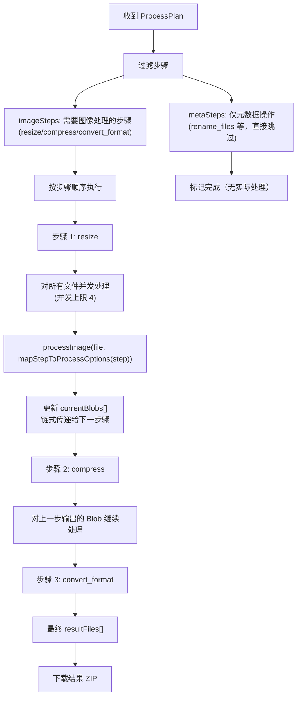

### 关键设计：步骤链式传递

```typescript
// 当前文件数据：每个步骤产生新的 Blob，链式传递给下一个步骤
let currentBlobs = files.map(f => ({ blob: f, name: f.name }));

for (const step of imageSteps) {
  const nextBlobs = new Array(currentBlobs.length);

  await processWithConcurrency(currentBlobs, async (item, i) => {
    const inputFile = new File([item.blob], item.name);
    const result = await processImage(inputFile, mapStepToProcessOptions(step));
    nextBlobs[i] = { blob: result.blob, name: buildOutputFileName(...) };
  });

  currentBlobs = nextBlobs;  // 上一步的输出 = 下一步的输入
}
```

### AI 参数防御（clamp）

```typescript
// 前端对 AI 生成的参数做防御性 clamp
// 防止 AI 幻觉产生的异常参数导致处理器崩溃

case 'resize': {
  // 尺寸 clamp 到 [1, 10000]
  const w = Math.max(1, Math.min(10000, Math.round(p.width)));
  const h = Math.max(1, Math.min(10000, Math.round(p.height)));
}

case 'compress': {
  // 质量 clamp 到 [1, 100]
  const quality = Math.max(1, Math.min(100, Math.round(p.quality)));
}
```

---

## 8. 知识库 RAG 系统

### 8.1 知识灌入流程

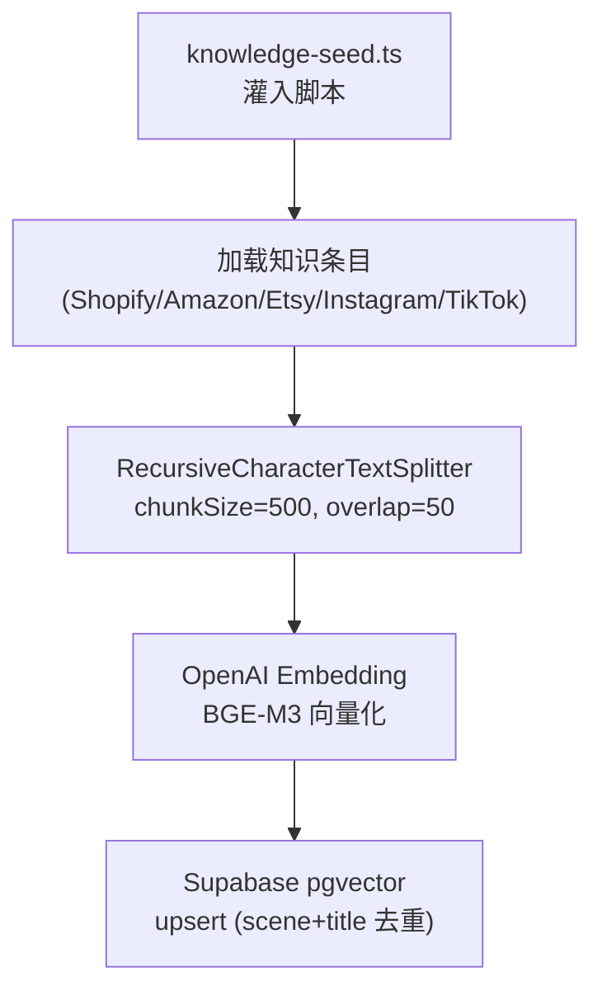

### 8.2 知识检索流程

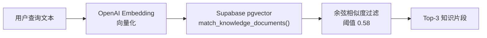

### 8.3 面试话术

> **问："你的 RAG 系统是怎么做的？为什么选择 CRAG？"**

> 我们的 RAG 不是简单的 "检索 → 拼接 → 生成"。普通 RAG 最大的问题是检索到了不相关的噪音知识，反而会误导 LLM 生成错误的计划。
>
> 所以我们实现了 Corrective RAG（自纠错检索增强生成）。流程是这样的：
>
> 1. 先做**向量语义检索**（BGE-M3 Embedding + pgvector 余弦相似度，阈值 0.58）
> 2. 检索到的知识不是直接喂给 Planner，而是先过一道 **GradeKnowledge 节点**——用 LLM 评估这些知识片段是否真的和用户目标相关
> 3. 如果不相关（比如用户问"优化淘宝主图"，但检索到了 Instagram 的指南），会触发 **Query Rewriter** 重写查询（翻译关键词、提取核心意图），然后用重写后的查询重新检索
> 4. 最多重试 2 次，如果还是不相关就降级——不带知识直接让 Planner 生成计划
>
> 这个设计的好处是：**根除了"检索噪音污染生成质量"的问题**，同时保证了系统的鲁棒性——任何环节失败都有降级路径，不会卡死。
