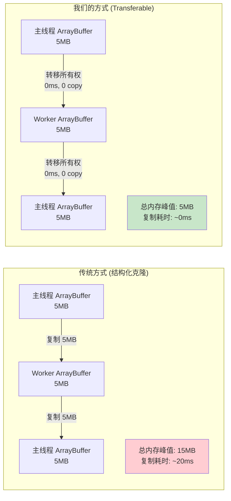
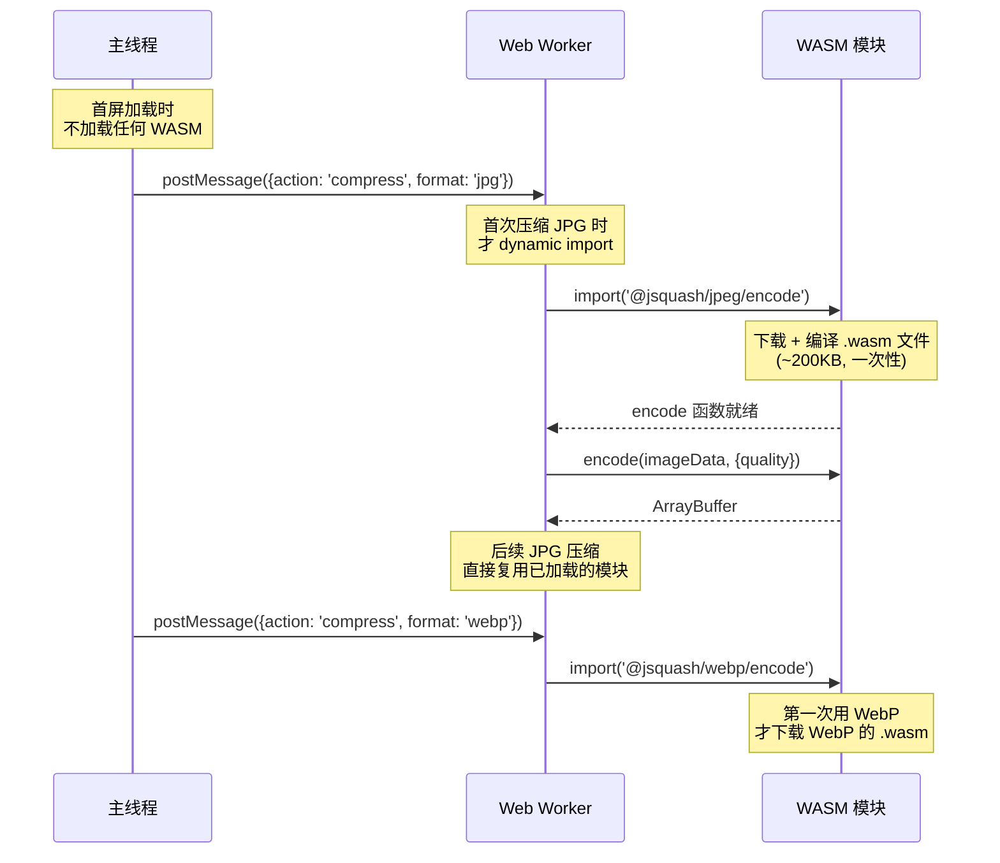
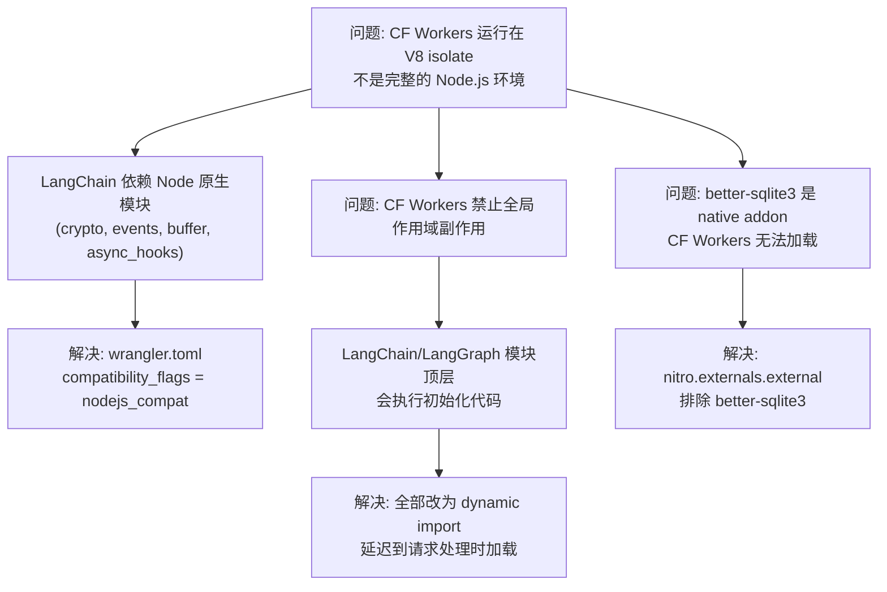
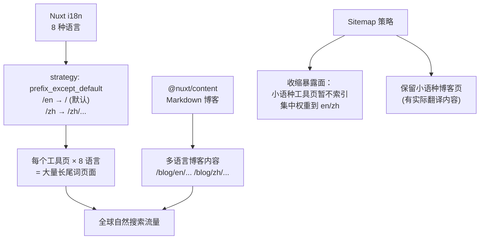
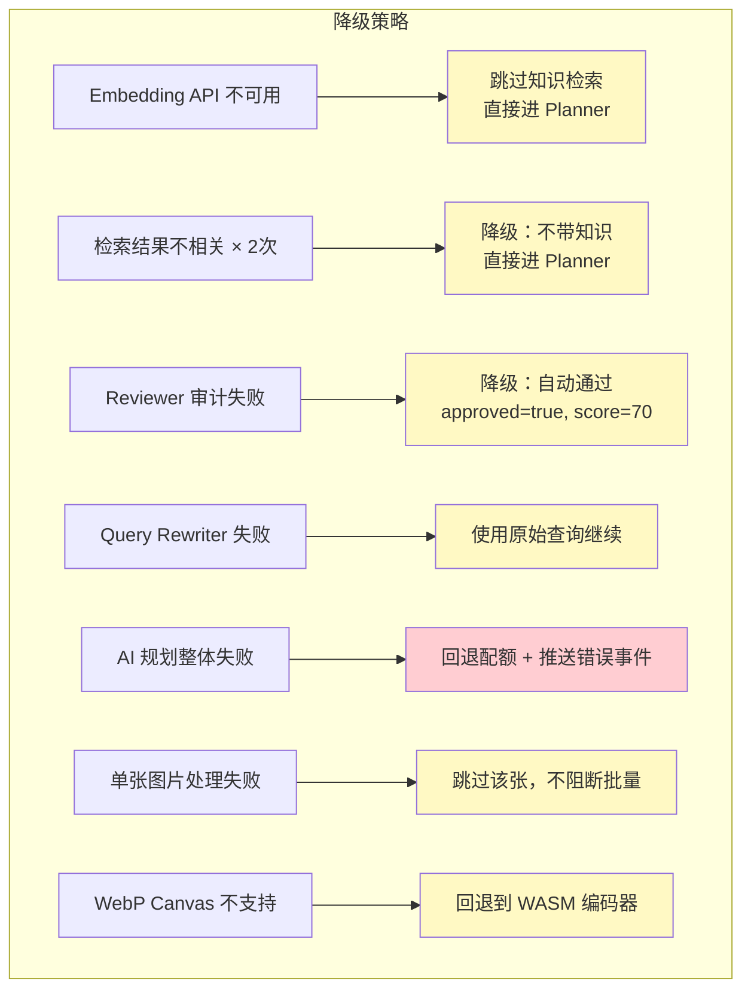

# PixelSwift 面试准备（四）：工程亮点与高频面试 Q&A

> 本文档汇总项目的工程难点、性能优化策略，以及面试官最可能追问的问题和参考回答。

---

## 1. 五大工程亮点

### 亮点 1：零拷贝数据传输 (Transferable Objects)



```typescript
// 发送时：第二个参数 [buffer] 表示转移所有权
worker.postMessage({ id, buffer, options }, [buffer]);
// 此后主线程的 buffer 变为 detached（不可用），内存归 Worker

// 返回时：同样转移
postMessage({ id, type: 'complete', result: { buffer: resultBuffer } }, [resultBuffer]);
```

**面试话术：**
> 图片处理涉及大量二进制数据，5MB 的图片如果用结构化克隆在主线程和 Worker 之间来回复制，会产生 15MB 内存峰值和明显的复制延迟。我们使用 `Transferable Objects` 实现零拷贝——把 ArrayBuffer 的所有权直接转移给 Worker，内存不复制，转移耗时接近零。处理完再转移回来。整个过程内存峰值只有 5MB。

---

### 亮点 2：WASM 懒加载 + Worker 内部按需实例化



**Vite 配置关键：**

```typescript
// nuxt.config.ts
vite: {
  plugins: [wasm(), topLevelAwait()],
  worker: {
    format: 'es',
    plugins: () => [wasm(), topLevelAwait()],  // Worker 内部也需要 WASM 支持
  },
  optimizeDeps: {
    exclude: ['@jsquash/webp', '@jsquash/jpeg', '@jsquash/avif'],  // 不预打包
  },
}
```

**面试话术：**
> WASM 编码器的 .wasm 文件有几百 KB，如果首屏全部加载会影响 FCP。我们的策略是完全懒加载——首屏不加载任何 WASM 模块，只有用户真正触发压缩操作时，才在 Worker 内部通过 `dynamic import` 按需加载对应格式的编码器。而且 Worker 内部的 WASM 需要特殊的 Vite 插件支持（`vite-plugin-wasm` + `vite-plugin-top-level-await`），我们对 Worker 的 Vite 构建做了单独配置。

---

### 亮点 3：Cloudflare Workers 兼容性攻坚



**面试话术：**
> 在 Cloudflare Workers 上跑 LangChain 是有坑的。CF Workers 基于 V8 isolate，不是完整的 Node.js 环境，而 LangChain 依赖了 crypto、events、async_hooks 等 Node 原生模块。我们通过开启 `nodejs_compat` 兼容标志解决了这个问题。
>
> 另一个更隐蔽的坑是：CF Workers 禁止在全局作用域执行副作用代码——但 LangChain 的模块在 import 时就会执行初始化。我们的解决方案是把所有 LangChain 相关的 import 改成 `dynamic import`，封装成延迟加载函数，只在第一次被调用时才 import 并缓存实例。

---

### 亮点 4：SEO 长尾词批量构建



---

### 亮点 5：全链路降级保护



---

## 2. 高频面试 Q&A

### Q1: "为什么图片处理放在前端而不是后端？"

> **回答：** 有三个核心原因：
>
> 1. **隐私安全**：用户的图片永远不离开浏览器，不上传到服务器。这是我们的核心卖点之一，对于商业敏感图片（电商产品图、设计稿）用户非常在意这一点。
> 2. **零边际成本**：每个用户的图片处理消耗的是他自己浏览器的 CPU 和内存，服务端不承担带宽和计算成本。即使用户量暴增，后端成本也不会线性增长。
> 3. **响应速度**：省去了上传 → 服务端处理 → 下载的网络往返，5MB 的图片在本地处理只需 2-3 秒，而上传到服务器可能光网络传输就要 5-10 秒。
>
> 当然前端处理也有挑战——浏览器的图片编码器质量不如服务端（比如 Canvas API 的 JPEG 编码比 MozJPEG 差很多），所以我们引入了 WebAssembly 编码器来弥补。

### Q2: "Web Worker 和主线程怎么通信？有性能问题吗？"

> **回答：** 通过 `postMessage` 通信。主要的性能瓶颈在数据传输——图片的 ArrayBuffer 可能有几 MB。如果用默认的结构化克隆，会产生完整的内存复制。我们用了 `Transferable Objects` 优化：
>
> ```javascript
> worker.postMessage({ buffer }, [buffer]);
> ```
>
> 第二个参数 `[buffer]` 告诉浏览器"把这个 ArrayBuffer 的所有权转移给 Worker，不需要复制"。转移后主线程的 buffer 变成 detached 状态（不可用），内存归 Worker 所有。处理完后再用同样的方式转移回来。
>
> 这样整个过程零内存拷贝，5MB 的图片传输耗时接近 0ms。

### Q3: "WASM 在 Web Worker 里怎么加载？遇到过什么坑？"

> **回答：** 遇到的主要问题是 Vite 的构建配置。Worker 是独立的执行上下文，它的模块解析和 WASM 加载需要单独配置。具体来说：
>
> 1. 需要 `vite-plugin-wasm` 插件让 Vite 识别 `.wasm` 文件
> 2. 需要 `vite-plugin-top-level-await` 因为 WASM 的实例化是异步的
> 3. Worker 的 Vite 配置需要单独指定 `worker.plugins`，不能共享主线程的插件配置
> 4. `@jsquash` 系列包需要从 `optimizeDeps.exclude` 中排除，否则 Vite 预打包会破坏 WASM 的加载路径
>
> 还有一个跨域问题：如果 WASM 文件和页面不同源，浏览器会拒绝 `WebAssembly.instantiate()`。在开发环境下 Vite 的 HMR 代理解决了这个问题，但生产环境需要确保 WASM 文件和页面同源部署。

### Q4: "LangGraph 是什么？为什么不用简单的链式调用？"

> **回答：** LangGraph 是 LangChain 团队推出的状态图编排框架，核心能力是支持**条件边和回环**。
>
> 简单的链式调用（A → B → C）无法处理 "如果 B 的结果不好就重做 A" 这种场景。我们的 CRAG 管线有两条回环：
>
> 1. 检索质量回环：如果向量检索的结果被 LLM 判定为不相关，就重写查询再检索
> 2. 计划质量回环：如果审计模型认为计划有问题（参数不合理、逻辑矛盾），就打回给 Planner 重新生成
>
> LangGraph 的 `addConditionalEdges` API 天然支持这种条件分支，比自己用 if-else 循环写要清晰很多，而且它内置了状态管理（Annotation），每个节点读取和更新的状态都是类型安全的。

### Q5: "SSE 和 WebSocket 有什么区别？为什么选 SSE？"

> **回答：** SSE 是单向推流（服务端 → 客户端），WebSocket 是双向通信。我们的场景是：
>
> 1. 前端发一个 POST 请求
> 2. 后端经过多个 AI 节点逐步处理，每个节点完成时推送进度
> 3. 最后推送完整的计划
>
> 这完全是单向的——前端不需要在流式过程中向后端发送任何数据。用 SSE 就够了，而且：
>
> - SSE 基于 HTTP，走标准的请求-响应模型，更容易通过代理和 CDN
> - Cloudflare Workers 原生支持 SSE（`createEventStream`），但 WebSocket 需要 Durable Objects
> - SSE 自带断线重连机制（虽然我们没用到）
> - 实现更简单，后端就是普通的 HTTP handler + EventStream

### Q6: "你说 AI 生成的参数合规率 100%，怎么做到的？"

> **回答：** 这是通过三层防护实现的：
>
> 1. **结构化输出约束**：使用 `withStructuredOutput(zodSchema, { method: 'jsonMode' })`，让 LLM 只能输出符合 Zod Schema 的 JSON。Schema 定义了每个字段的类型和范围。
>
> 2. **二次参数校验**：即使通过了 Zod Schema 校验，我们还有 `validateStepParams()` 做 action 级的精细校验——比如 resize 的 width 必须在 1-10000、compress 的 quality 必须在 1-100。如果不通过，整个计划会被拒绝。
>
> 3. **前端 clamp 防御**：即使前面两层都放过了，前端在执行计划时还会对每个参数做 clamp——`Math.max(1, Math.min(10000, value))`。这是最后一道防线，确保无论 AI 返回什么数值，实际执行的参数都在安全范围内。
>
> 加上 Reviewer 模型的审计回环（会检查参数合理性，比如 quality=5 太激进），这四层防护叠在一起，确保了执行成功率。

### Q7: "向量检索的阈值 0.58 是怎么定的？"

> **回答：** 这是通过实验调参定的。我们用的 Embedding 模型是 BGE-M3，它的余弦相似度分布特点是：
>
> - 真正强相关的 query-document 对，相似度在 0.6-0.8
> - 弱相关的在 0.5-0.6
> - 不相关的通常 < 0.5
>
> 最初我们设的 0.6，但发现一些合理的查询（特别是中文查询翻译后和英文知识的匹配）被过滤掉了。调到 0.55 又放进了太多噪音。最终 0.58 是在"召回率 vs 精度"之间的平衡点——既能召回中等强度的匹配，又能过滤掉完全无关的结果。
>
> 而且我们还有 GradeKnowledge 节点做二次过滤，所以阈值可以稍微宽松一点，交给 LLM 做最终的相关性判断。

### Q8: "如果用户发送的不是图片处理相关的请求怎么办？"

> **回答：** System Prompt 里有明确的兜底规则。如果用户输入与图片处理无关（比如"今天天气怎么样"），AI 会输出一个空步骤的计划，confidence 设为 0.1，并在 risks 里返回提示信息。前端检测到 `steps.length === 0` 就会进入 `unsupported` 状态，显示对应的提示文案，不执行任何操作。配额不会被浪费——虽然已经调了 AI，但返回的是有效的"拒绝执行"结果。

### Q9: "大文件处理时内存怎么控制？"

> **回答：** 几个策略：
>
> 1. **Worker 隔离**：所有图片数据在 Worker 线程中处理，即使 Worker OOM 也不会 crash 主线程
> 2. **Transferable 零拷贝**：避免数据在主线程和 Worker 之间复制，峰值内存 = 原始文件大小（而不是 3 倍）
> 3. **并发限制**：批量处理时最多 4 个并发，防止同时解码多张大图导致内存尖峰
> 4. **逐张释放**：处理完一张就释放其 ArrayBuffer，不累积
> 5. **Bitmap 及时 close**：`createImageBitmap` 后及时调用 `bitmap.close()` 释放底层纹理内存

### Q10: "Nuxt SSR 对这个项目有什么意义？"

> **回答：** SSR 主要解决两个问题：
>
> 1. **SEO**：图片工具网站的流量主要来自搜索引擎。SSR 确保搜索引擎爬虫拿到的是完整渲染的 HTML（包含 title、meta、h1、结构化数据），而不是一个空壳的 SPA。配合 i18n 的 8 种语言，每个工具页生成 8 个语言版本的 URL，批量覆盖长尾关键词。
>
> 2. **首屏性能**：SSR 的 HTML 包含完整的页面结构，用户看到首屏内容不需要等 JavaScript 加载和执行。图片处理的 JS（Worker、WASM）是按需懒加载的，不影响首屏时间。
>
> 但注意：图片处理本身不需要 SSR——它是纯客户端行为。我们用 `useImageProcessor` 这种 Composable 封装了浏览器 API（Worker、Canvas），这些代码只在客户端执行。Nuxt 的 SSR 只渲染页面结构和文案，不涉及图片处理逻辑。
