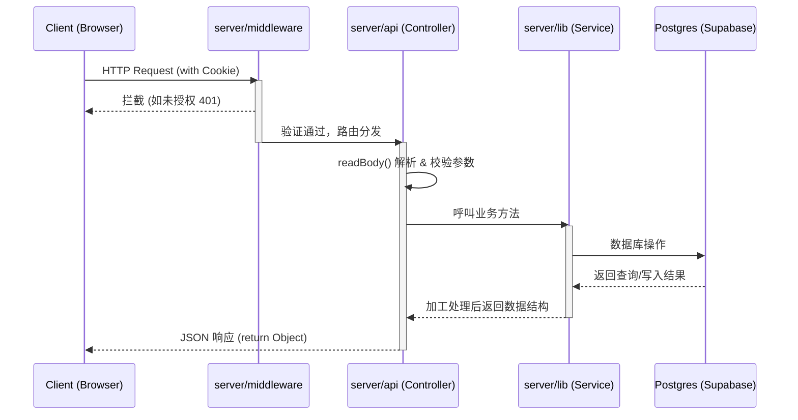

# Nuxt 3 服务端 (Nitro) 开发规范与目录指南

Nuxt 3 的服务端由底层的 **Nitro** 引擎驱动。它支持全屏 SSR（服务端渲染）、API 路由以及边缘计算。为了保持代码结构清晰和团队维护效率，针对本项目的 API 和服务端开发须遵循以下规范。

---

## 1. 核心目录与功能拆解

服务端的所有代码强制收敛于项目根部的 `server/` 目录中。Nitro 会对部分目录进行自动扫描和生成。

| 目录名称             | 自动映射路由   | 核心作用与使用场景                                                                                                        |
| :------------------- | :------------- | :------------------------------------------------------------------------------------------------------------------------ |
| `server/api/`        | `/api/*`       | **核心接口层 (Controller)**。自动转换为带有 `/api` 前缀的 RESTful 接口。建议仅处理参数校验与路由分发。                    |
| `server/routes/`     | `/*`           | **根目录路由**。不会附加 `/api` 前缀。常用于承接 `sitemap.xml` 或第三方支付/OAuth 的 Webhook。                            |
| `server/middleware/` | (所有请求前)   | **全局中间件**。所有到达后端的请求都会被拦截。用于 JWT 鉴权、限流、注入 Security Headers。                                |
| `server/plugins/`    | (服务器启动时) | **生命周期插件**。Nitro 服务进程启动时仅执行一次。用于初始化数据库连接池、启动 Cron 任务等。                              |
| `server/utils/`      | (不可见)       | **工具函数层**。这里的导出会**自动注入全局**，在 `api/` 或 `routes/` 中可免 `import` 直接使用。                           |
| `server/lib/`        | (不可见)       | **核心业务层 (Service/Model)**。存放厚重的业务逻辑（如 Supabase 交互、发邮件），供上层 API 调用。_(非常规内置，强烈推荐)_ |

---

## 2. 请求处理流转机制 (Request Flow)



---

## 3. 核心代码编写规范

### 3.1 路由声明 (defineEventHandler)

一定要使用 `defineEventHandler` 包装你的函数。不要手动操作 `req/res`。

```typescript
// server/api/hello.get.ts
export default defineEventHandler(async (event) => {
  // 返回 JSON 极其简单，直接 return JS 对象即可
  return {
    success: true,
    data: "Hello from Nitro",
  };
});
```

### 3.2 读取参数规范

| 操作类型         | 推荐内置 API                        | 注意事项                          |
| :--------------- | :---------------------------------- | :-------------------------------- |
| 读取 URL Query   | `getQuery(event)`                   | 自动解析传入的 `?a=1&b=2`         |
| 读取 POST Body   | `await readBody(event)`             | 自动反序列化 JSON，需 `await`     |
| 读取动态路径参数 | `getRouterParam(event, 'id')`       | 适用于文件名带有 `[id].ts` 的路由 |
| 读取 Header      | `getHeader(event, 'Authorization')` | -                                 |

### 3.3 异常与错误处理 (createError)

当你需要返回 HTTP 400 或 500 等状态码时，必须抛出 `createError` 对象，防止状态码意外转为 HTTP 200 返回。

```typescript
export default defineEventHandler(async (event) => {
  const body = await readBody(event);

  if (!body.userId) {
    throw createError({
      statusCode: 400,
      statusMessage: "Validation Failed", // 简短说明 (Status Text)
      message: "The field userId is required.", // 详细细节 (Response JSON payload)
    });
  }
});
```

### 3.4 严禁跨界与内存泄漏

- **绝对隔离**：绝不允许在 `server/` 文件夹引入任何 `.vue` 组件或 DOM 原生 API（如 `window` / `document`）。
- **Event 隔离上下文**：调用服务端方法获取环境变量时，推荐携带 `event` 上下文。例如：`const config = useRuntimeConfig(event)`，这在高并发异步流中能保证跨请求的安全隔离。
