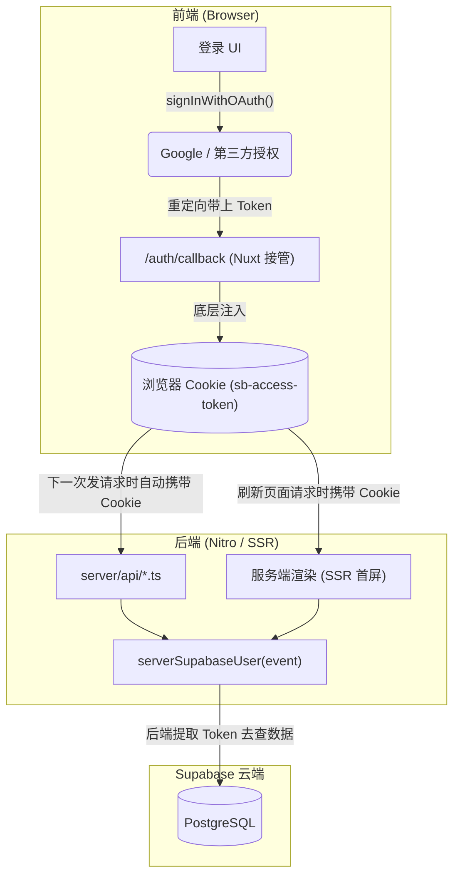

# Supabase + Nuxt3 快速上手教程

Supabase 是一个开源的 Firebase 替代品，核心基于强大的 **PostgreSQL** 数据库。它开箱即用地提供了：数据库、身份验证 (Auth)、对象存储 (Storage) 以及实时订阅 (Realtime) 功能。

本项目通过官方 `@nuxtjs/supabase` 模块深度集成了 Supabase。

---

## 1. 核心安全策略与 API Key 矩阵

在使用 Supabase 之前，请务必理解两个最关键的安全角色，这直接决定了代码该写在前端还是后端：

| 机制 / Key | 运行环境 | RLS 穿透能力 | 用途 | 危险等级 |
| :--- | :--- | :--- | :--- | :--- |
| **RLS (行级安全策略)** | 数据库层 | `N/A` | Postgres 中设定的规则卡点（例如：只允许读取自己的数据） | 🛡️ 防御核心 |
| **Anon Key** | 浏览器 / 客户端 | ❌ 不可穿透 | 公开 API 密钥，随前端打包，所有请求**被 RLS 严格限制** | 🟢 安全 (公共) |
| **Service Role Key** | 服务器 / API | ✅ **完全穿透** | 服务端操作数据库，无视 RLS（如：后台核销配额、删除全站数据） | 🔴 极度危险 |

> [!WARNING]
> 千万防内鬼：**绝不可将 Service Role Key 暴露或打包到带有 `.vue` 的前台环境变量中**，这会导致全站数据直接向公众敞开！

---

## 2. SSR 与 Cookie 鉴权自动流动 (Data Flow)

由于集成了 Nuxt Supabase 模块，前后端鉴权通信实现了极致的自动化（黑魔法）：



> **结论：在开发后端 API 接口时，完全不需要手动去解析 `Authorization: Bearer XXX` 标头，直接从 event 里解包即可。**

---

## 3. 常用代码片段集 (Snippets)

### 3.1 前端 (Vue Components 层面)

在前端统统使用 `@nuxtjs/supabase` 提供的全局 Composables 工具，无需额外 `import`。

**用户登录态获取：**
```vue
<script setup>
const user = useSupabaseUser(); // 响应式的 ref 对象，未登录即为 null
const client = useSupabaseClient<Database>(); // 获取带类型推断的 SDK
</script>
```

**OAuth 鉴权登录：**
```typescript
async function handleGoogleLogin() {
  const client = useSupabaseClient();
  const { error } = await client.auth.signInWithOAuth({
    provider: 'google',
    options: { redirectTo: "https://your-website.com/auth/callback" }
  });
}
```

**前端请求数据库 (服从 RLS)：**
```typescript
async function fetchMyTodos() {
  const client = useSupabaseClient();
  const { data, error } = await client
    .from('todos')
    .select('id, title, is_done')
    .eq('is_done', false)
    .order('created_at', { ascending: false })
    .limit(10); 
    
  return data;
}
```

---

### 3.2 后端 (Nitro API / SSR 层面)

如果是存在于 `server/api/` 的服务器环境，需要根据你的目的采用不同的权限载体：

| 目标操作 | 推荐使用的 SDK 解包方式 | 说明 |
| :--- | :--- | :--- |
| **鉴定当前发起请求的人是谁** | `serverSupabaseUser(event)` | 安全验证。提取 Cookie 中的 Token 换取 User 对象用于效验身份。 |
| **帮当前用户查点数据库** | `serverSupabaseClient(event)` | 带着当前访客的帽子去查库。（服从 RLS） |
| **管理员强制执行高权操作** | `serverSupabaseServiceRole(event)` | 上帝之手。忽略该请求用户的身份，拥有系统级最高控制权。（无视 RLS） |

**上帝之手：Service Role 举例（非常危险）：**
```typescript
import { serverSupabaseServiceRole } from '#supabase/server'

export default defineEventHandler(async (event) => {
  // 生成一台有最高权限的后台操作客户端
  const adminSupabase = serverSupabaseServiceRole(event);
  
  // 无视任何防御，强行清空全站的 tasks （十分危险的动作）
  const { error } = await adminSupabase
    .from('tasks')
    .delete()
    .neq('id', 0); 

  return { success: !error }
})
```
